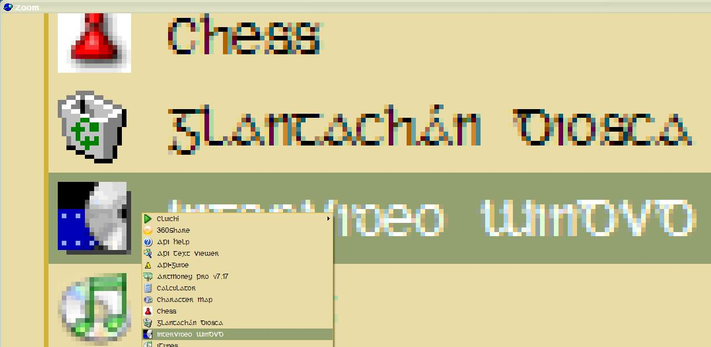



## Zoom At Cursor

### Description

Takes a snapshot at the cursor location and zooms it x8. No configurable settings at present but the functionality is there if you want it. It's a useful tool for those who need to quickly check the fine detail in some graphical work.
 
### More Info
 

             |
---                |---
**Submitted On**   |2006-03-01 20:56:20
**By**             |[Eric O'Sullivan](https://github.com/Planet-Source-Code/PSCIndex/blob/master/ByAuthor/eric-o-sullivan.md)
**Level**          |Intermediate
**User Rating**    |5.0 (10 globes from 2 users)
**Compatibility**  |VB 6\.0
**Category**       |[Graphics](https://github.com/Planet-Source-Code/PSCIndex/blob/master/ByCategory/graphics__1-46.md)
**World**          |[Visual Basic](https://github.com/Planet-Source-Code/PSCIndex/blob/master/ByWorld/visual-basic.md)
**Archive File**   |[Zoom\_At\_Cu197747322006\.zip](https://github.com/Planet-Source-Code/eric-o-sullivan-zoom-at-cursor__1-64506/archive/master.zip)

### API Declarations

lots :-)

